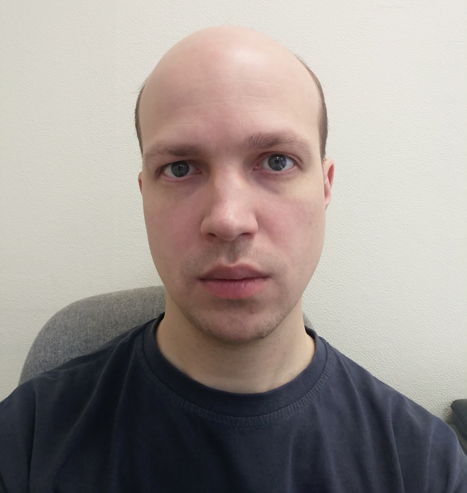

**Сергей Баранов**

36 лет
Москва, Марьино
  +7 926 184 45 38
  kretch910@rambler.ru

Опыт работы 13 лет и 10 месяцев

октябрь 2013 – работает сейчас
8 лет и 4 месяца
Инженер-электроник
Фабрика техники, Москва
Производство банковского оборудованья.

Обязанности:
	- составление технологического процесса изготовления изделий;
	- нормирование операций технологических процессов изготовления изделий;
	- своевременная корректировка нормы времени;
	- составление спецификаций на сборку серийных изделий;
	- сбор информации по комплектности поставляемых полуфабрикатов и своевременное внесение изменений в документацию в соответствии с поступившими компонентами;
	- оптимизация технологических процессов изготовления изделий;
	- провидение выборочного контроля качества выпускаемых изделий, разработка инструкций по устранению брака и доведение их до бригадиров, слесарей сборщиков, монтажников приборов;
	- обучение персонала и демонстрация способов работы с инструментом и материалами;
	- сбор информации о некачественных комплектующих и доведение её до поставщиков;
	- работа с поставщиками по оптимизации цены и повышению качества изготавливаемых комплектующих и полуфабрикатов;
	- работа с разработчиками по оптимизации конструкции с целью удешевления и повышения качества выпускаемых изделий;
	- проведение консультаций сервис-партнёров по конструкции и комплектующим выпускаемых изделий.

май 2012 – август 2013
1 год и 4 месяца
Инженер АСУ ТП
ООО «Объединённые Пивоварни Хейнекен» филиал «Волга», Нижний Новгород
	
Обязанности:
	Ремонт, наладка и обслуживание электрооборудования и пневматических систем цеха производства пива и линий розлива.

сентябрь 2005 – октябрь 2009
4 года и 2 месяца
Инженер-исследователь
Научно Исследовательский Институт измерительных Систем, Нижний Новгород

Обязанности:
	Разработка и наладка цифровых и аналоговых электрических схем согласно ТЗ, разработка технической документации, проведение испытаний.

**Образование**

Высшее образование, дневная/очная форма 2009
Нижегородский Государственный Технический Университет им. Алексеева
	Факультет: Институт радиоэлектроники и информационных технологий
	Специальность: Радиотехника
Среднее специальное образование, дневная/очная форма 2005
Нижегородский Технический Колледж
	Специальность: Ремонт и обслуживание радиоэлектронной техники
Знания и навыки

**Профессиональные навыки**

	- Опытный пользователь ПК (Windows, Word, Excel, Power Point, AutoCad, OrCad, P-Cad, Internet)
	- Знание современной электронной элементной базы.
	- Умение самостоятельно разобраться в аналоговой и цифровой схемотехнике, рассчитать режимы работы элементов и цепей, составить электрическую схему по монтажу печатной платы.
	- Опыт ремонта электрооборудования и различной техники.
	- Опыт самостоятельных разработок схем и печатных плат согласно ТЗ.
	- Опыт монтажа и отладки спроектированной схемы.
	- Опыт работы с современными измерительными приборами (осциллограф, спектроанализатор и т. п.)

**Компьютерные навыки**

Windows, Word, Excel, Power Point, AutoCad, OrCad, P-Cad, Internet

**Гражданство**

Россия

**Семья**

Не состоит в браке, есть дети
